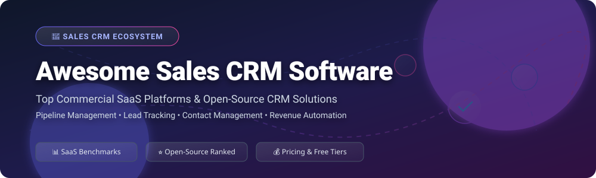

      

# 🚀 Awesome Sales CRM Software Ecosystem 💼

> **Curated directory of top-tier commercial SaaS CRM platforms and self-hosted open-source CRM software for pipeline management, lead tracking, contact discovery, and automated revenue operations.**

**Last updated: October 2026** 📅

---

## 📌 Table of Contents

- [🌐 Sector Overview & Market Size](#-sector-overview--market-size)
- [📊 Commercial SaaS Sales CRM Platforms](#-commercial-saas-sales-crm-platforms)
- [🔓 Open-Source CRM GitHub Repositories](#-open-source-crm-github-repositories)
- [🛠️ Selection Guide & Developer Frameworks](#-selection-guide--developer-frameworks)
- [🤝 How to Contribute](#-how-to-contribute)
- [⚠️ Data Governance & Disclaimer](#%EF%B8%8F-data-governance--disclaimer)
- [⭐ Star History](#-star-history)
- [💖 Support & Sponsoring](#-support--sponsoring)

---

## 🌐 Sector Overview & Market Size

📈 **Estimated Global Market Size**: The global Customer Relationship Management (CRM) software market is estimated at approximately **$77.6 Billion in 2026** (projected to exceed $140 Billion by 2030 at a ~12.5% CAGR).

🧩 **Market Dynamics & Fragmentation**: The sales CRM industry is **moderately fragmented**. Heavyweight market-anchor platforms (*Salesforce, Microsoft Dynamics 365, HubSpot, and Zoho*) capture over 50% of total enterprise market share, while a vibrant ecosystem of specialized niche SaaS solutions and community-driven open-source alternatives cater to mid-market, SMBs, and developer-led startups.

---

## 📊 Commercial SaaS Sales CRM Platforms

Below is a curated benchmark of leading commercial sales CRM software, ordered by overall enterprise market scale and company revenue.

| Platform 🏢 | Company Scale (Revenue / Valuation) 💰 | Starting Tier Pricing 🏷️ | Free Tier / Free Trial Details 🎁 | Primary Focus & Key Strengths 🎯 |
|---|---|---|---|---|
| **[Microsoft Dynamics 365 Sales](https://dynamics.microsoft.com/en-us/sales/)** | ~$245B Rev (Parent Microsoft) / $3.1T Market Cap | $65/user/month (Professional Edition) | 30-day free trial (Full Enterprise Suite access, no credit card required) | Enterprise CRM with native Office 365, Teams, Copilot AI & Power Platform integration. |
| **[Salesforce Sales Cloud](https://www.salesforce.com/products/sales-cloud/)** | ~$34.9B Revenue / $300B+ Market Cap | $25/user/month (Starter Suite) | 30-day free trial (Starter & Professional tiers, no credit card required) | Industry-standard enterprise CRM with AppExchange ecosystem, Lightning platform & Einstein AI. |
| **[HubSpot Sales Hub](https://www.hubspot.com/products/sales)** | ~$2.17B Revenue / $30B+ Market Cap | $20/user/month (Starter Edition) | Free Forever Plan (Unlimited users, up to 2,500 monthly email sends & core CRM) | Visual sales pipelines, meeting scheduling, email tracking & SMB ease-of-use. |
| **[Zoho CRM](https://www.zoho.com/crm/)** | ~$1.0B+ Revenue / $5B+ Private Valuation | $14/user/month (Standard Edition) | Free Forever Plan (Up to 3 users, leads, contacts, deals & 1GB storage) or 15-day free trial | Value-leading CRM with Zia AI, omnichannel support & deep Zoho One ecosystem. |
| **[Freshsales](https://www.freshworks.com/crm/sales/)** | ~$596M Revenue / $4B+ Market Cap | $15/user/month (Growth Edition) | Free Forever Plan (Up to 3 users, built-in chat, contact management & email) or 21-day free trial | Integrated communication CRM with Freddy AI, built-in cloud telephony & email tracking. |
| **[SugarCRM](https://www.sugarcrm.com/)** | ~$100M+ Revenue / $500M+ Private Valuation | $49/user/month (Sell Essentials, min 3 users) | 7-day managed free trial (Available upon request) | Flexible enterprise CRM with strong workflow customization and hybrid/on-premise deployment options. |
| **[Pipedrive](https://www.pipedrive.com/)** | ~$100M+ ARR / $1.5B Valuation | $14/user/month (Essential Edition) | 14-day free trial (Full access to features, no credit card required) | Visual deal pipeline management with drag-and-drop stages, activity reminders & lead routing. |
| **[Insightly](https://www.insightly.com/)** | ~$30M+ Revenue / $150M+ Valuation | $29/user/month (Plus Edition) | Free Forever Plan (Up to 2 users, 2,500 records & core CRM features) or 14-day free trial | Sales CRM integrated with project management, lead routing, and post-sale delivery tracking. |
| **[Close CRM](https://close.com/)** | ~$20M+ ARR / $100M+ Valuation | $49/user/month (Startup Edition) | 14-day free trial (Includes call credits & automated sequences, no credit card required) | High-velocity inside sales CRM with built-in VoIP calling, SMS automation & email sequences. |
| **[Copper CRM](https://www.copper.com/)** | ~$15M+ ARR / $80M+ Valuation | $23/user/month (Basic Edition) | 14-day free trial (Full Google Workspace integration test, no credit card required) | Native Google Workspace CRM embedded directly inside Gmail, Google Calendar & Drive. |

---

## 🔓 Open-Source CRM GitHub Repositories

Self-hosted open-source CRM software empowers organizations with complete data sovereignty, custom extendibility, and zero per-user licensing fees. The list below is sorted by **GitHub Stars_Count (descending)**.

### 🌟 Ranked Open-Source CRM Projects

1. **[Odoo CRM](https://github.com/odoo/odoo)**  
     
   **The most comprehensive open-source ERP & Sales CRM suite** (LGPL-3.0). Integrates lead scoring, sales pipeline management, automated quotation generation, and email marketing with full accounting & inventory modules. Best for integrated business operations.

2. **[Twenty](https://github.com/twentyhq/twenty)**  
     
   **Modern open-source CRM with a Notion-like UI** (AGPL-3.0). Built on React, TypeScript, and NestJS featuring a native GraphQL API, custom objects, kanban deal pipelines, and automated email sync. Designed for modern tech teams and developer-first startups.

3. **[Monica](https://github.com/monicahq/monica)**  
     
   **Open-source Personal Relationship Manager (PRM)** (AGPL-3.0). Focused on tracking personal interactions, life events, custom notes, and key reminders across personal and professional networks.

4. **[ERPNext](https://github.com/frappe/erpnext)**  
     
   **Full-featured open-source ERP & CRM built on Frappe Framework** (GPL-3.0). Features end-to-end lead management, customer communication tracking, sales orders, billing, and omni-channel support.

5. **[Krayin CRM](https://github.com/krayin/laravel-crm)**  
     
   **Modern Laravel & Vue.js Open-Source CRM for SMEs** (MIT). Offers lead tracking, custom activity scheduling, deal stages, quote generation, and REST API support. Ideal for PHP/Laravel developers.

6. **[Dolibarr ERP & CRM](https://github.com/Dolibarr/dolibarr)**  
     
   **Modular open-source ERP and CRM for small businesses and freelancers** (GPL-3.0). Provides straightforward prospect tracking, proposal management, sales orders, and invoicing tools.

7. **[SuiteCRM](https://github.com/salesagility/SuiteCRM)**  
     
   **The leading enterprise-grade open-source Salesforce alternative** (AGPL-3.0). Originating as a fork of SugarCRM Community Edition, SuiteCRM provides accounts, leads, opportunities, contract management, workflow automation, and extensive module add-ons.

8. **[Fat Free CRM](https://github.com/fatfreecrm/fat_free_crm)**  
     
   **Lightweight Ruby on Rails open-source CRM** (MIT). Clean code structure optimized for developer extension, account tracking, lead management, and quick team onboarding.

9. **[Corteza](https://github.com/cortezaproject/corteza)**  
     
   **Low-Code open-source platform with a turnkey CRM solution** (Apache-2.0). Features visual record builders, workflow automation engines, REST API integration, and cloud-native Docker support.

10. **[EspoCRM](https://github.com/espocrm/espocrm)**  
      
    **Fast and lightweight open-source CRM application** (GPL-3.0). Features an intuitive single-page web interface, Entity Manager for custom schema creation, webhooks, and REST APIs.

11. **[YetiForce CRM](https://github.com/YetiForceCompany/YetiForceCRM)**  
      
    **Feature-rich open-source CRM based on Vtiger** (YetiForce Public License). Offers advanced data security controls, process automation, widget dashboards, and business operations tracking.

12. **[Vtiger CRM Open Source](https://github.com/vtiger-crm/vtigercrm)**  
      
    **All-in-one open-source sales, marketing, and support suite** (VPL/MPL). Combines pipeline tracking, email campaign management, help desk ticketing, and inventory management.

13. **[OroCRM](https://github.com/oroinc/crm)**  
      
    **Flexible open-source B2B CRM** (OSL-3.0). Built on Symfony PHP framework, offering multi-channel sales pipeline tracking, e-commerce integrations, and customizable workflow engines.

14. **[CiviCRM](https://github.com/civicrm/civicrm-core)**  
      
    **Open-source constituent management software for non-profits** (AGPL-3.0). Specialized for donor tracking, member management, campaign contributions, and civic advocacy workflows.

---

## 🛠️ Selection Guide & Developer Frameworks

When choosing between commercial SaaS and open-source CRM solutions:

- 🏬 **Enterprise SaaS (Salesforce, Microsoft D365)**: Best for complex global sales forces needing out-of-the-box regulatory compliance, turnkey AI predictive analytics, and massive third-party integration marketplaces.
- 🚀 **Growth SaaS (HubSpot, Zoho, Pipedrive)**: Ideal for SMBs and scaling startups prioritizing visual pipeline management, fast setup, and low maintenance overhead.
- 🔓 **Modern Open-Source (Twenty, EspoCRM, Krayin)**: Best for tech companies and developers who want a modern stack (TypeScript/React or Laravel), native API access, full data privacy control, and custom schema extension without per-user licensing costs.
- 🏢 **Enterprise Open-Source (SuiteCRM, Odoo, ERPNext)**: Best for organizations requiring comprehensive business process integration (CRM + ERP + Billing) without vendor lock-in.

---

## 🤝 How to Contribute

Contributions are welcome! Please follow these guidelines:

1. 🍴 **Fork** this repository.
2. 📝 Add or update entries in `README.md` following the table or list formats above.
3. 📌 Ensure all descriptions remain objective, link directly to official sites or repository stargazers, and include verified pricing or Stars_Counts.
4. 🚀 Submit a **Pull Request** detailing your changes.

Check out our main awesome list directory: [Awesome-Awesome-Awesome](https://github.com/ishandutta2007/Awesome-Awesome-Awesome).

---

## ⚠️ Data Governance & Disclaimer

- 🔐 **Data Privacy & Compliance**: CRM platforms handle sensitive customer data, communication records, and revenue details. Self-hosted deployment requires proper server hardening, access control enforcement, and compliance with data protection laws (GDPR, CCPA, HIPAA).
- 🛠️ **Operational Responsibility**: Running open-source CRM software requires dedicated system administration for security updates, automated database backups, and environment upgrades.

---

## ⭐ Star History

---

## 💖 Support & Sponsoring

If you find this repository helpful for evaluating or choosing a Sales CRM platform:
- ⭐ **Star** this repository to help others discover it.
- 🔀 **Fork** it to keep your own reference or contribute updates.
- 📢 **Share** it with fellow developers, sales leaders, and founders.
- ☕ **Buy me a coffee**: Support ongoing maintenance on the [GitHub Sponsors Dashboard](https://github.com/sponsors/ishandutta2007).
